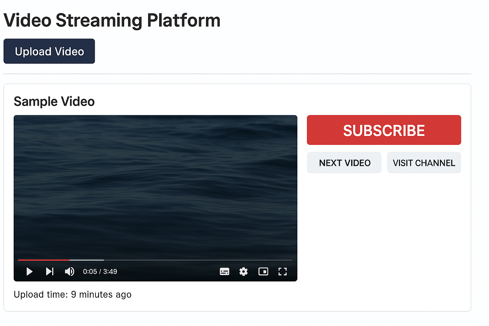

# 🎬 YouTube-Style Video Streaming Platform

This project is a YouTube-inspired video streaming platform built using **Flask**, **HTML/CSS/JS**, and integrates **FFmpeg**, **AWS S3**, and **SQLite**. Users can upload videos, view them in a sleek interface, and simulate basic YouTube-like features.

---

## 🚀 Features

- 🎥 Upload and stream videos via browser
- 💽 FFmpeg-based video processing (e.g. compression)
- ☁️ Upload to AWS S3 bucket (S3 credentials required)
- 🧾 SQLite database to store video metadata
- 🖥️ Frontend with responsive HTML/CSS/JavaScript
- 🔗 Channel visit and video linking functionality

---

## 🛠️ Technologies Used

- **Backend**: Python, Flask
- **Database**: SQLite
- **Frontend**: HTML, CSS, JavaScript
- **Video Processing**: FFmpeg
- **Cloud Storage**: AWS S3

---

## 📂 Project Structure

```
VideoStreamingProject/
│
├── app.py                      # Main Flask backend
├── requirements.txt            # Python dependencies
├── templates/
│   ├── index.html              # Home UI with video playback
│   └── upload.html             # Upload form UI
```

---

## 🔧 Installation & Setup

1. **Clone the repository** or extract the zip:
   ```bash
   git clone https://github.com/your-repo/video-streaming-app.git
   ```

2. **Install the dependencies**:
   ```bash
   pip install -r requirements.txt
   ```

3. **Install FFmpeg**:
   - [Windows](https://ffmpeg.org/download.html)
   - Make sure it's accessible via command line (`ffmpeg -version`)

4. **Set AWS credentials (optional)**:
   ```bash
   export AWS_ACCESS_KEY_ID=your_key
   export AWS_SECRET_ACCESS_KEY=your_secret
   ```

5. **Run the app**:
   ```bash
   python app.py
   ```

6. **Open in browser**:
   ```
   http://127.0.0.1:5000/
   ```

---

## 📸 Screenshots

### 📺 YouTube-Style Video Streaming Platform



---

## 📌 To-Do (Optional Ideas)

- Add like/comment system
- Video search and tags
- Full user login/signup
- Playlist or channel subscriptions

---


